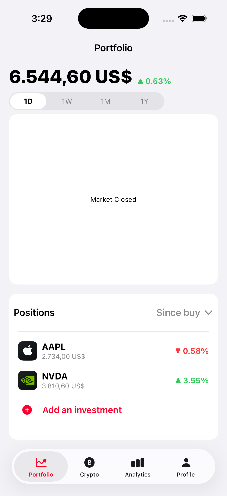
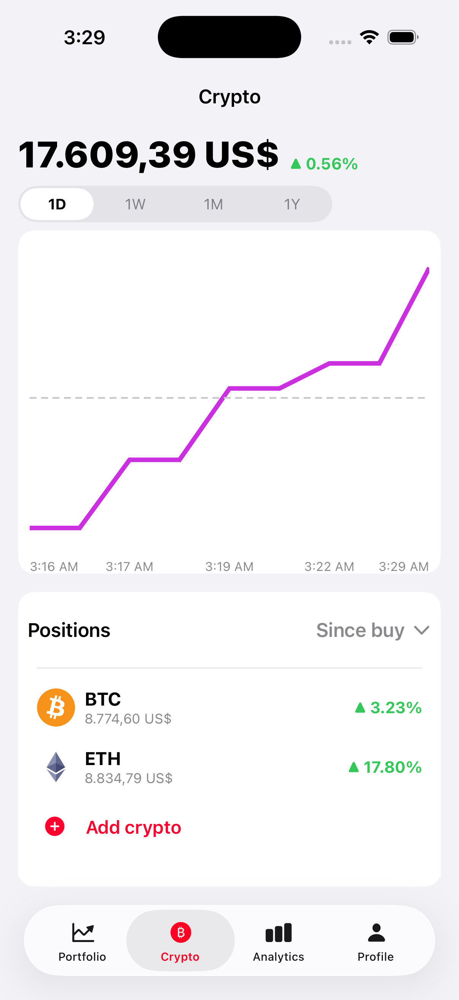
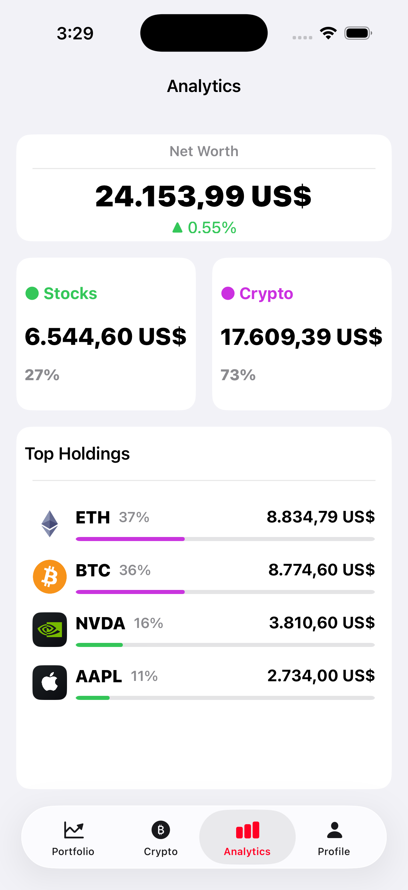
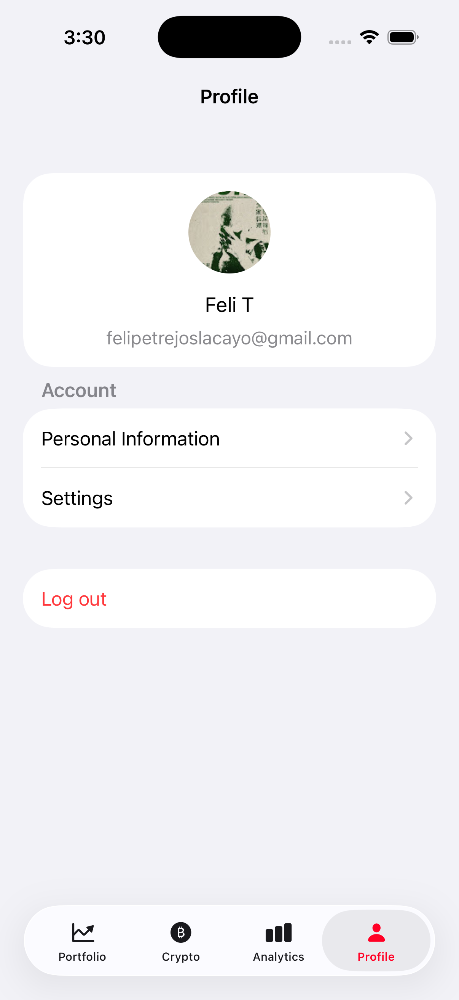

# Arc One

A personal finance app for iOS to track stocks and cryptocurrency portfolios with real-time market data.

## Features

- **Portfolio**: Track stock holdings with real-time quotes and interactive charts (1D/1W/1M/1Y)
- **Crypto**: Track 15+ cryptocurrencies with CoinGecko integration
- **Analytics**: Combined net worth, asset allocation, and top holdings breakdown
- **Authentication**: Email/password, Google Sign-In, and Face ID
- **Profile**: User settings and account management

## Architecture

Feature-based modular architecture with MVVM pattern:

```
Features/
├── Authentication/   # Login, signup, biometrics
├── Portfolio/        # Stock tracking, charts, market data
├── Crypto/           # Cryptocurrency tracking
├── Analytics/        # Combined portfolio analytics
└── Profile/          # User profile and settings
```

Each feature contains:
- `UI/` - View controllers and cells
- `Models/` - DTOs and ViewModels
- `Services/` - API and Firebase integration
- `Presentation/` - Data sources and coordinators

## Firestore Collections

```
users/{uid}/
├── holdings/              # Stock investments
├── crypto_holdings/       # Crypto investments
├── snapshots/             # Daily stock portfolio values
├── crypto_snapshots/      # Daily crypto portfolio values
├── intraday_points/       # Stock intraday tracking
└── crypto_intraday_points/# Crypto intraday tracking
```

## Tech Stack

| Category | Technology |
|----------|------------|
| UI | UIKit, Storyboards, DGCharts |
| Backend | Firebase Auth, Firestore, Storage |
| Stock Data | Finnhub API |
| Crypto Data | CoinGecko API |
| Auth | Google Sign-In, Face ID |

## Screenshots

| Portfolio | Crypto | Analytics | Profile |
|:---------:|:------:|:---------:|:-------:|
|  |  |  |  |

## Authors

Felipe Trejos and Paul Adrian Pupaza
